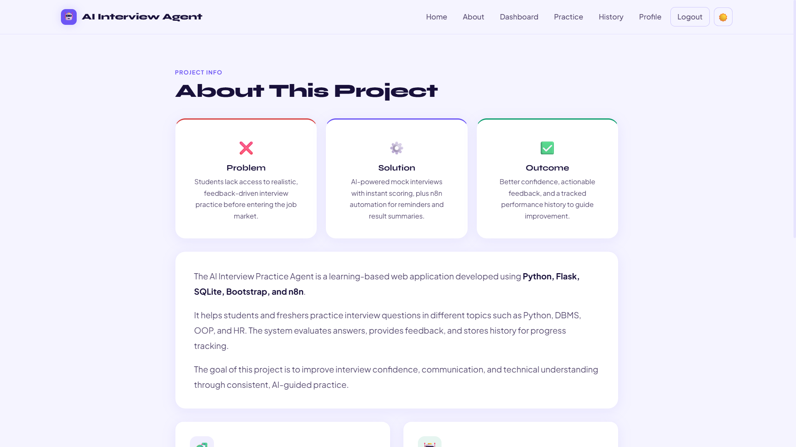
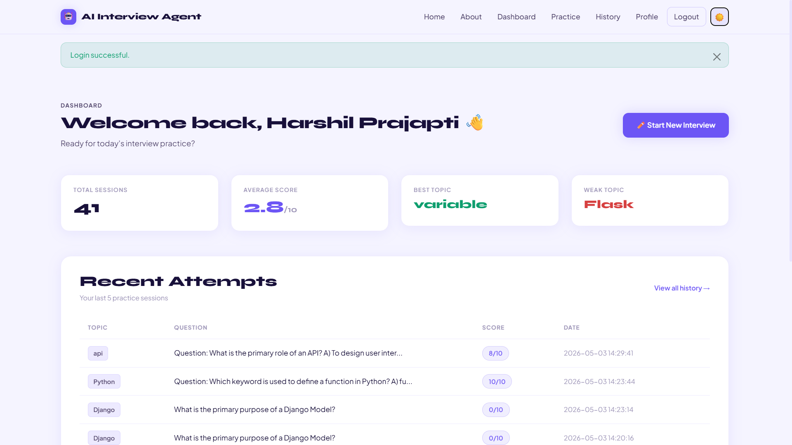
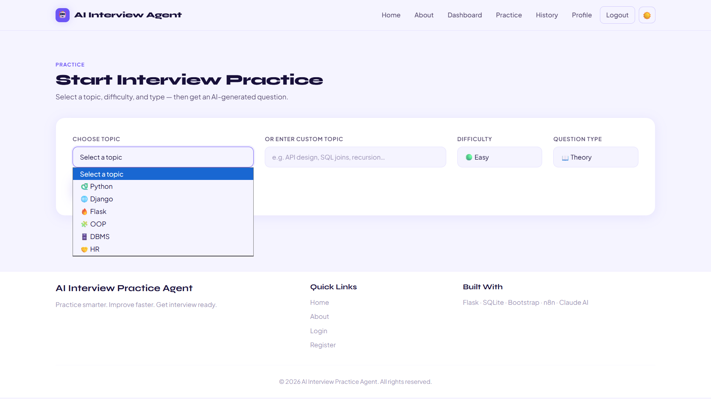
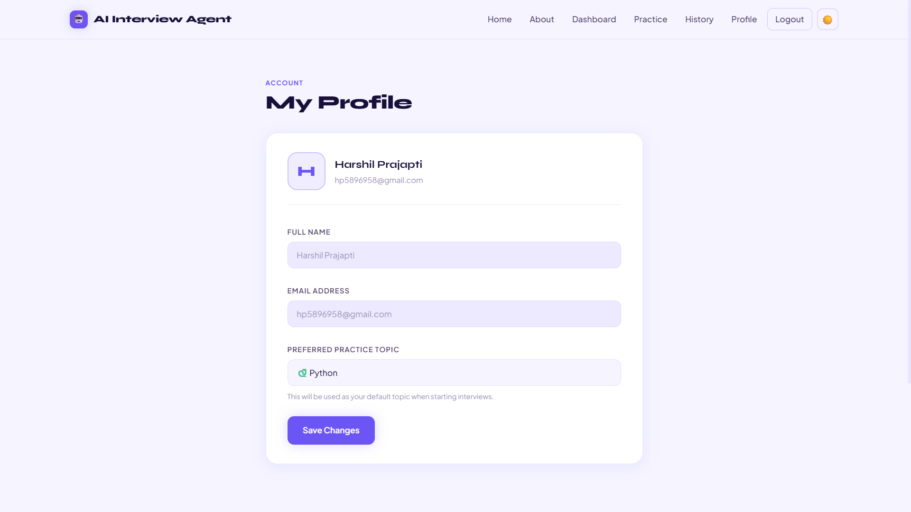
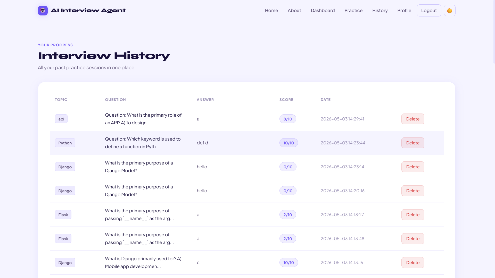
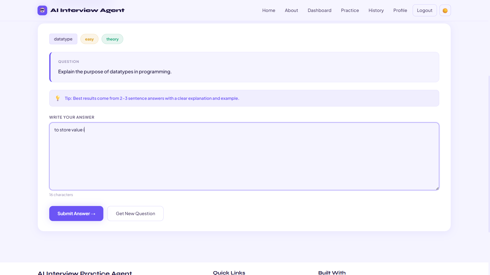
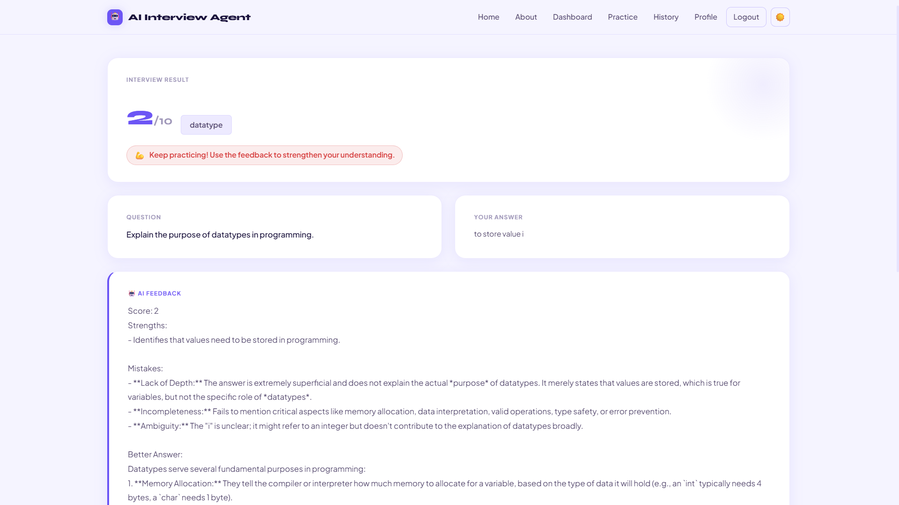

# 🤖 AI Interview Practice System

A smart web application that helps users practice interview questions and get instant feedback.

## 🚀 Features

- Dynamic question generation (Theory, Coding, MCQ, HR)
- Automated answer evaluation with score & feedback
- User dashboard to track performance
- Interview history storage
- Fallback system for reliability (works even if AI service fails)

## 🛠 Tech Stack

- Python
- Flask
- SQLite
- HTML, CSS
- AI Integration


## 📸 Screenshots

### 🏠 Home Page


### 📊 Dashboard


### 🎯 Interview Page


### 📈 Result Page


### History page


### Genrate-Answer page


### Evaluated-asnwer page



## ⚙️ Installation

```bash
git clone https://github.com/harshil962/AI-Interview-Agent.git
cd AI-Interview-Agent
pip install -r requirements.txt

Create .env file:

GEMINI_API_KEY=your_api_key

Run:

python app.py
📌 Note

API keys are not included for security reasons.

👨‍💻 Author

Harshil Prajapati


---

## 🔥 Final Tip (IMPORTANT)

Before upload:

✔ Remove API key  
✔ Test project  
✔ Clean code  

---

If you want next level:
👉 I can help you **make your GitHub look like professional developer profile (very important for jobs)**